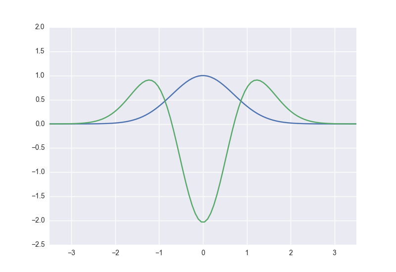

<!---
  NumPyを用いた数値計算の高速化 : 応用
-->

# 対象
Python及びNumPy初心者に向けて書いています. 「C言語は使えるけど最近Pythonを始めた」とか「Pythonらしい書き方がよくわからない」に該当する物理系の数値計算を目的とした方には特に有用かもしれません.

また, 自分の不勉強のために間違った記述があるかもしれません. ご容赦ください. 

# あらまし
内容は[NumPyを用いた数値計算の高速化 : 基礎](http://qiita.com/jabberwocky0139/items/c3620fb2f011f20a633b)のつづきです. `ndarray`のユニバーサル関数や演算を用いて可能な限りforループを使わずに基礎的な数値計算のアルゴリズムを実装していきます. 

# 微分
物理の基礎方程式には微分がつきものです. 微分は線形写像なので行列方程式で記述できます. たとえばある関数の2回微分を計算するとしましょう. これを前進差分と後退差分を用いて表現することにします:
<!---
$$-\frac{1}{2}\frac{d^2}{dx^2}\psi(x) = E_n\psi(x)$$
--->

$$\frac{d^2}{dx^2}\psi(x) = \frac{\psi(x + \Delta x) - 2\psi(x) + \psi(x - \Delta x)}{\Delta x^2} + {\cal O}(\Delta x^2)$$

$\psi(x)$を空間$L$を$\Delta x$で差分化してあげると

$$\psi(x)\rightarrow \{\psi(x_0), \psi(x_1), ..., \psi(x_{n-1}), \psi(x_n)\} = \{\psi_0, \psi_1, ..., \psi_{n-1}, \psi_n\}\hspace{1cm}x_i = -L/2 + i\Delta x$$

微分は行列形式で書くことができます:

$$\frac{d^2}{dx^2}\psi(x) = \frac{1}{\Delta x^2}
\begin{pmatrix}
\psi_{-1} -2\psi_0 + \psi_1\\
\psi_0 -2\psi_1 + \psi_2\\
\vdots\\
\psi_{n-2} -2\psi_{n-1} + \psi_n\\
\psi_{n-1} -2\psi_n + \psi_{n+1}
\end{pmatrix}
\simeq \frac{1}{\Delta x^2}
\begin{pmatrix}
-2&1&0&\cdots&0\\ 
1&-2 &1&\cdots&0\\
0 & 1&-2&& \vdots\\
\vdots&&&\ddots&1\\
0& \cdots& 0 &1& -2
\end{pmatrix}
\begin{pmatrix}
\psi_0\\
\psi_1\\
\vdots\\
\psi_{n-1}\\
\psi_n
\end{pmatrix}
=K\psi
$$

はじっこで嫌なことが起きていますが, $\Delta x$が小さければ大丈夫です. さあ行列にできてしまえばこっちのものです. 

## 実装
Pythonで実装してあげます. 初期関数を適当に用意して差分化してあげます:

```py3
>>> import numpy as np
>>> def f(x):
...     return np.exp(-x**2)
... 
>>> L, N = 7, 100
>>> x = np.linspace(-L/2, L/2, N)
>>> psi = f(x)
>>> psi
array([  4.78511739e-06,   7.81043424e-06,   1.26216247e-05,
         2.01935578e-05,   3.19865883e-05,   5.01626530e-05,
         7.78844169e-05,   1.19723153e-04,   1.82206228e-04,
	     ...,
         2.74540100e-04,   1.82206228e-04,   1.19723153e-04,
         7.78844169e-05,   5.01626530e-05,   3.19865883e-05,
         2.01935578e-05,   1.26216247e-05,   7.81043424e-06,
         4.78511739e-06])
```
そして微分の行列を用意します. そのためには劣対角成分に値を格納しなければなりません. そこで`ndarray`のスライスと`np.vstack`を組み合わせます:

```py3
>>> K = np.eye(N, N)
>>> K
array([[ 1.,  0.,  0., ...,  0.,  0.,  0.],
       [ 0.,  1.,  0., ...,  0.,  0.,  0.],
       [ 0.,  0.,  1., ...,  0.,  0.,  0.],
       ..., 
       [ 0.,  0.,  0., ...,  1.,  0.,  0.],
       [ 0.,  0.,  0., ...,  0.,  1.,  0.],
       [ 0.,  0.,  0., ...,  0.,  0.,  1.]])
>>> K_sub = np.vstack((K[1:], np.array([0] * N)))
>>> K_sub
array([[ 0.,  1.,  0., ...,  0.,  0.,  0.],
       [ 0.,  0.,  1., ...,  0.,  0.,  0.],
       [ 0.,  0.,  0., ...,  0.,  0.,  0.],
       ..., 
       [ 0.,  0.,  0., ...,  0.,  1.,  0.],
       [ 0.,  0.,  0., ...,  0.,  0.,  1.],
       [ 0.,  0.,  0., ...,  0.,  0.,  0.]])
>>> K = -2 * K + K_sub + K_sub.T
>>> K
array([[-2.,  1.,  0., ...,  0.,  0.,  0.],
       [ 1., -2.,  1., ...,  0.,  0.,  0.],
       [ 0.,  1., -2., ...,  0.,  0.,  0.],
       ..., 
       [ 0.,  0.,  0., ..., -2.,  1.,  0.],
       [ 0.,  0.,  0., ...,  1., -2.,  1.],
       [ 0.,  0.,  0., ...,  0.,  1., -2.]])
```
これで積を取れば2階微分完了です:

```py3
dx = L/N
psi_2dot = dx**-2 * np.dot(K, psi)
```



