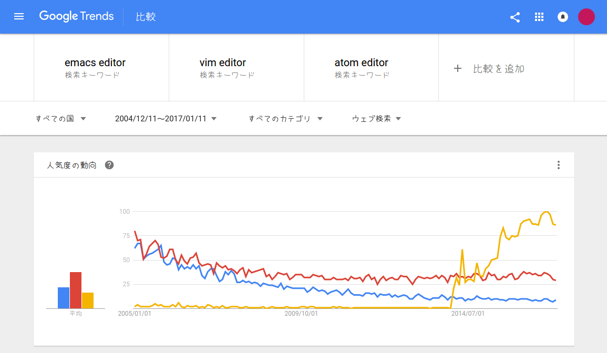
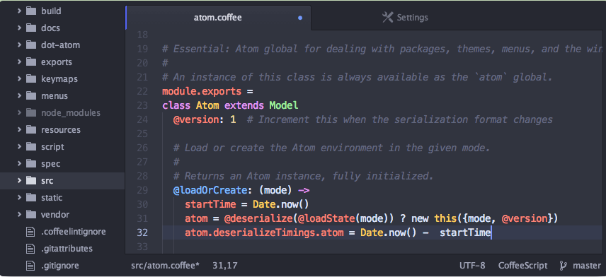
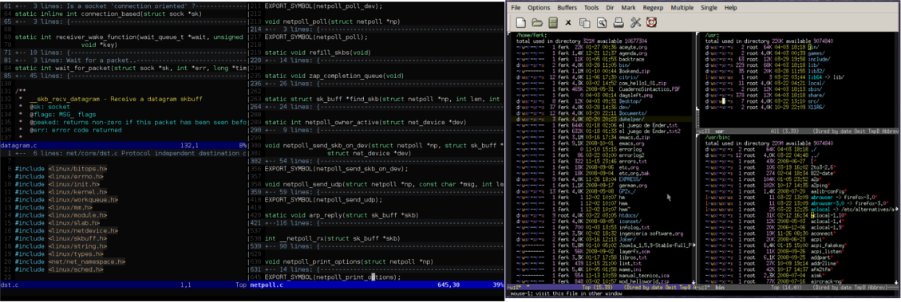
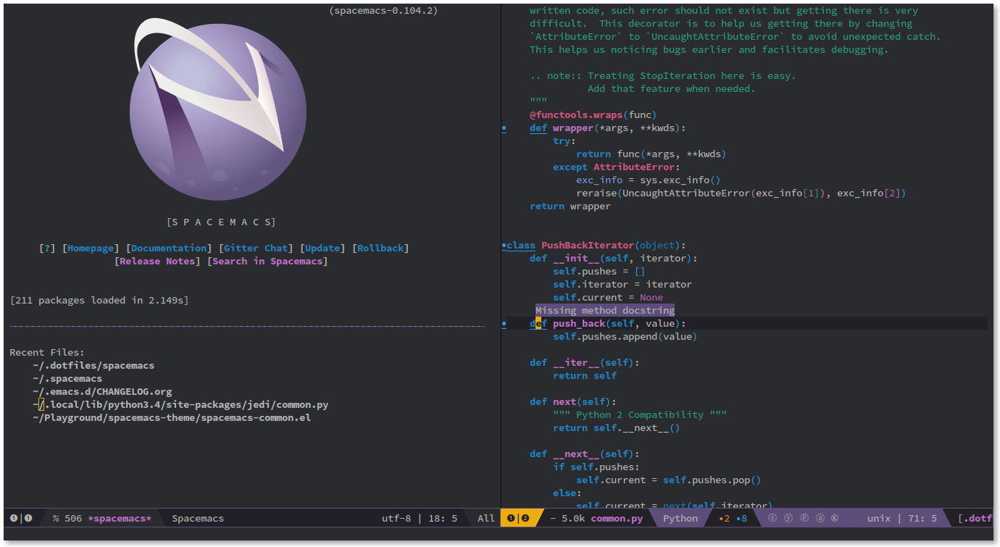

<!---
	新春 Emacsゆるふわコーデ大会(仮)
-->

名前は[新春 Ubuntuゆるふわコーデ大会](http://qiita.com/jabberwocky0139/items/704cc8c48379c97edd82)に引きずられていますが, 目指すところはちょっと違います. 新年ネタでもありません. 

# あらまし
ちょっと長い前置きです. **内容の半分以上は冗談です.** さらっと読み流してください. 

## 戦況の変化
 エディタ界の歴史地区といえば「Emacs vs Vi(m)」ですが, ここに食い込まんばかりの勢いを持ったエディタが現れました. Atomです:

青がEmacs, 赤がVim, 黄色がAtom

リリースされてからの伸びがすごいです. ここ数年に限って言えばAtomの一人勝ちと言ってもいいかもしれません. 少なくとも新規参入者の数で言えばAtomの圧勝でしょう. 「テキストエディタなんて古い. これからはIDEだ」と言われて久しいですが, そんな時代にこの伸びは驚異的です[^1].

その理由の一つとして, Emacs・Vimに比べてキーバインドに癖がないことが挙げられます. 「Ctrl-c Ctrl-v でコピペ」「Ctrl-fで検索」といったWindowsのショートカットキーとの親和性が高いことからも敷居の低さが伺えます. 

## Emacs・Vimの勝機
でもプログラマの方々なら「カーソル移動にカーソルキーなんてありえん」と思う方も多いと思います. 自分はEmacs・Vimの強いところは, 多機能であることは当然として, 「ホームポジションから移動せずにカーソル移動ができる」「すべての機能に(マウスを使わず)キーボードから容易にアクセスできる」ことの2点だと思っています[^2]. これを高いレベルで実現できるのはEmacs・Vimの他に無く, これこそが慣れてしまうと他のエディタに戻れなくなる所以なのでしょう.

Atomでもプラグインを駆使すればEmacs・Vimに相当するような機能を追加することはできますが, 20年以上(Emacsは30年以上)に渡り秘伝のタレを熟成させてきた古参にはそれ相応のアドバンテージがあるはずです[^3]...が, それについて語りだすと長くなってしまうので省略. 

## しかしながら
とはいえいくら古参に底力があってもAtomに入信した方がEmacs・Vimに改宗することはあまり期待出来ないように思えますし, またその必要も無いでしょう. 古参が再び日の目を見る時代が来るのかどうかは, 僕にはよくわかりません. 

ちなみにグラフを見る限りではVim人気は下げ止まりの様子が伺えます. 実際最近のVimコミュニティはなかなかの盛り上がりを見せているようで, Emacs派としては羨ましい限りです. 一方Emacsは...どこまで下がるのでしょうか. (日本の)Emacs界は, るびきちさんがひとり気を吐いているような空気を感じます.

さて, これほどAtomが盛り上がった理由は本当に「敷居の低さ」だけなのでしょうか. 

## ※ただしイケメンに限る
もうこの一言に尽きます. Atomはイケメンだった:

[Atom本家より](https://atom.io/)

[Vim](https://ja.wikipedia.org/wiki/Vim)・[Emacs](https://ja.wikipedia.org/wiki/Emacs) from Wikipedia

どんなにEmacsが多機能でも, Vimのモードが優れていても, それを主張するのがイケメンでなければどうにもならない...

### 例をあげよう
|        | Atom  | Emacs|Vim|
|--------|-------|------|---|
| 年齢 | 新進気鋭   | おっさん | おっさん |
| 多機能 | 便利   | 煩雑 |煩雑     |
| カスタマイズ | 簡単   | Emacs Lisp(笑 |Vim Script(笑|

参考:[Pixiv](http://dic.pixiv.net/a/%E2%80%BB%E3%81%9F%E3%81%A0%E3%81%97%E3%82%A4%E3%82%B1%E3%83%A1%E3%83%B3%E3%81%AB%E9%99%90%E3%82%8B)

...流石に自虐が過ぎました. とはいえ, 見た目のインパクトはAtomの圧勝です. ちょっと古いバージョンの画像を持ってきたのは不公平な気もしますが, たぶんどう見積もっても負けてます. これはもう整形なくして勝ち目[^4]はない...！

## イケメン『Spacemacs』顕る
ざっくり言うとSpacemacsは「Emacs + Vim = 最強」という理念のもと生まれたプロジェクトです. 

[Vimも秘伝のタレも飲み込むEmacsの超強力ディストリビューションSpacemacsまとめ](http://qiita.com/ryosukes/items/d0ec5094a9d3d636f7bb)

こちらの記事が詳しいです. どれだけ便利かということはとりあえず置いておいて...

[Spacemacs](https://github.com/syl20bnr/spacemacs) from Github

すごいイケメンだ！ とても未来を感じます. 「EmacsかVimはじめてみたい」という方には是非是非おすすめしたいところです. Emacs + VimというアイデアではありますがベースはEmacsなので, これを足ががりにもっとEmacs界隈も盛り上がることを期待しています. もう少し日本語の情報が増えてくるといいな.. 

## Spacemacsやめました
しかしながら自分はSpacemacsをやめてしまいました. Spacemacsの設定ファイルである`.spacemacs`は`init.el`とは異なる様式を持っています. デフォルトで様々な機能が有効になって便利である一方, その設定が一部隠蔽されている[^5]ことから`.spacemacs`をEmacsLispでカスタマイズしようとするとどうもうまくいかない部分があり, 結局しっくり来ず普通のGNU Emacsに戻ってきてしまいました. 

はじめからSpacemacsで入門していればこんな壁には遭遇しなかったでしょう. なまじ`init.el`をこねくり回してきた手前, その遺産が活かしづらいとなると移行に踏みとどまってしまいます. 

## はやくイケメンになりたい
とはいえSpacemacsのスタイルには惹かれるものがあります. `init.el`をいじってSpacemacsのいいところを取り込み, Emacsにゆるふわコーデを施しましょう！

## 方針
1. 初めてEmacsに入門する方 
→ Spacemacsをはじめましょう. 以下お読みに必要はありません. 
2.  Emacsを使っているものの有り難みがよくわからないという方
→ Spacemacsをはじめましょう. 以下お読みに必要はありません. 
3.  `init.el`が十分熟成しており, かつEmacsをゆるふわにしたい方 
→ お進みください. 
4.  `init.el`が十分熟成しており, かつ無骨なEmacsを愛している方 
→ 以下お読みに必要はありません. 

いじるポイントは

* パッケージ管理(package.el)
* カラーテーマ(solarized)
* モードライン(powerline)
* タブ(tabbar)
* フォント(ゆたぽん)
* スプラッシュ(dashboard)

の6点です. ゆるふわであることに加えてエディタとして機能的であることを重視します. 

以下からが本題です. ここまで読んだ方なら, この長い前置きには特に意味がなかったことにお気づきのことでしょう.

[^1]: 出始めで盛り上がってるだけと邪推することもできるかもしれませんが...
[^2]: 異論は認めます. 
[^3]: 熟成させすぎて腐ってる部分もあるかも...そのひとつがEmacsのunexec問題なのかもしれません. 
[^4]: 熟練のギークの方にとっては心底どうでもいいことでなんでしょうね.
[^5]: ように当時の自分は感じました.
