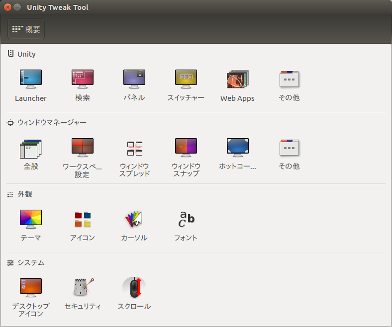
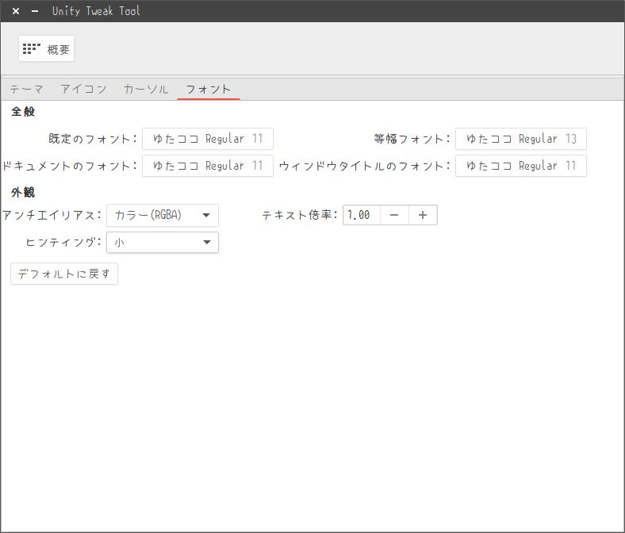
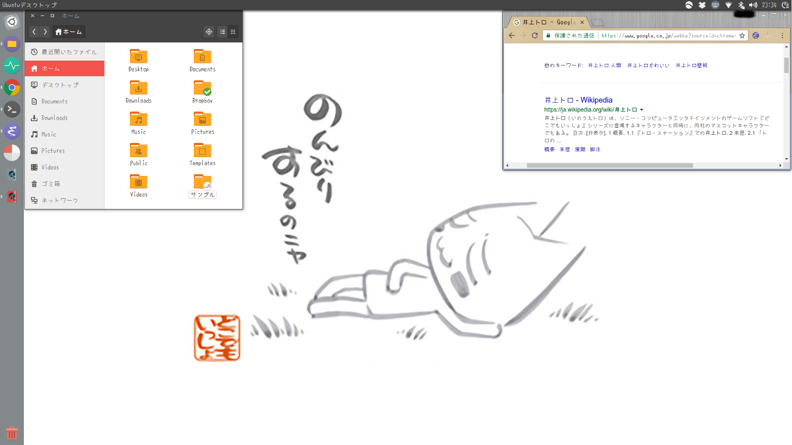

<!---
	新春Ubuntuをゆるふわコーデ大会
-->


# あらまし
別に新年ネタではありません. Ubuntuのデフォルトテーマからの脱却を試みましょう.

## 何故に？
Ubuntuっぽい見た目に飽きました. 

## どこを攻める？
`unity-tweak-tool`でテーマを変えることができます. が, テーマだけでは生ぬるい. フォントも変えます. 壁紙も変えます. 

## 方向性は？
ゆるふわ. 

# テーマ
[Numix Project](https://numixproject.org/)というLinuxのテーマを作っているプロジェクトがあります. 最近流行りのフラットデザインです.

## こーで
`unity-tweak-tool`のインストール:

```bash
sudo apt install unity-tweak-tool
```
Numixのテーマとアイコンをインストール:

```bash
sudo add-apt-repository ppa:numix/ppa
sudo apt update
sudo apt-get install -y numix-gtk-theme numix-icon-theme-circle
```


`unity-tweak-tool`の「外観」欄にある「テーマ」を`Numix`に, 「アイコン」を`Numix-circle`に変更しましょう.

# フォント
ゆるふわ度に於いては[ゆたココ(ゆたぽん)](http://net2.system.to/pc/font.html)が最強です. コーディング用途ではないので, エディタ等のフォントには「ゆたぽん（コーディング）バックスラッシュ」がおすすめです. 

## こーで


`unity-tweak-tool`の「外観」欄にある「フォント」をぜんぶ「ゆたココ Regular」にしてしまいましょう. ご自分のエディタ・端末・ブラウザなどもゆたぽん系に統一しましょう. 

# 壁紙
井上トロさん一択でしょう. 

# まとめ


心がやすらぎます. みなさんもどうぞ. 


